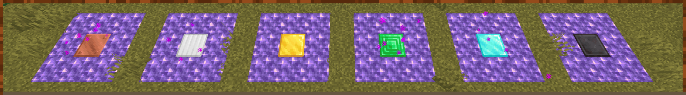

# Amethysttravelling
A Minecraft datapack for building fast travel points.
It utilizes amethysts and makes them a consistently needed resource for fast travel.

## Features:
- fast travel between distant places and diminsions
  - can display the name of the destination after travelling
  - allows to carry nearby npcs (also mobs)
- different tiers of fast travel points
  - affects speed and available diminsions
- in-game manual (written book)
- designed to be multiplayer friendly
- no necessary resource pack
  - optional translations are available with the resource pack: [Amethysttravelling-language-pack](https://github.com/Pretorer/Amethysttravelling-language-pack)

## Usage:
To get the in-game manual, enter the command `/trigger Amethysttravelling.getManual`.

### Building
To build a fast travel point, a 3x3 platform must be constructed from amethyst blocks. 
The "catalyst" block in the center determines the time it takes for the fast travel point to channel. 
In addition, not all fast travel points can be kept permanently active in all diminsions. 
For this the right "catalyst" must be chosen. 
To activate the platform of a fast travel point, you must stand in the middle of the platform.

  
**Image:** Different tiers of fast travel points.

Block     | Default channelization time  (in s)| Dimensions
----------|:----------------------------------:|-----------
Copper    | 10                                 | Overworld
Iron      | 6                                  | Overworld
Gold      | 3                                  | Overworld
Emerald   | 2                                  | Overworld
Diamond   | 1.5                                | Overworld, Nether
Netherite | 1                                  | Overworld, Nether, End

### Connecting
To connect two fast travel points, the first one must be marked first. To do this, stand in the middle of an activated unconnected platform and hold an amethyst shard in your hand. Now you can go to the second activated unconnected platform and do the same as you did with the first.

### Traveling
To travel, stand in the center of an activated connected fast travel point and hold an amethyst shard in your hand. Now the fast travel point starts to channel.
NPCs can be taken along by standing on the platform. However, these also consume an amethyst shard.
After traveling, the platform must be re-entered or the amethyst shard must be taken in hand again.

  
**Image:** A player who travels using amethyst shards.

### Renaming 
When a fast travel point is renamed with a name tag, its name is shown when a player travels to it.

  
**Image:** Display the name of a renamed fast travel point after traveling.

### Destruction
If a block of the platform of an activated fast travel point is removed, the fast travel point is destroyed. 
A possibly connected platform will now also no longer work.

## Datapack installation:
Install this datapack like any other datapack by placing it in the world's datapack folder and entering the command `/reload`.
Alternatively: when a new world is created, open the datapacks menu and drag this datapack into the Minecraft window.

## Datapack removal:
The command `/function amethysttravelling:remove` removes all entities, scoreboards and unloads all permanently loaded chunks created by this datapack.
To reinstall this datapack, use the command `/datapack enable "file/AmethystTravelling"`.

## Configuration:

### Channeling time
Channeling time can be adjusted for different tiers of fast travel points.
For example, a netherite fast travel point that lets you travel into the end can be slower than an emerald fast travel point, if desired.
Use `/scoreboard objectives setdisplay sidebar AT.config` to see all channeling times in ticks (20 ticks are one second). To hide the scoreboard use `/scoreboard objectives setdisplay sidebar`.
To update a specific channelization time of a tier shown in the scoreboard, use `/scoreboard players set <tier> AT.config <ticks>` and update all existing fast travel points with the command `/function amethysttravelling:platform/update_existing_platforms`.

### Meterials
You can easily change the materials for the outer ring of the platform by changing the json file *"./AmethystTravelling/data/amethysttravelling/tags/blocks/magical_block.json"* and the item you use for the travel in *"./AmethystTravelling/data/amethysttravelling/tags/items/magical_item.json"*. 
If you want to add a new block for a custom tier of a fast travel punt, edit *"./AmethystTravelling/data/amethysttravelling/tags/blocks/condenser.json"*, the fast travel point is not known by default and you will get the lowest tier and 10 seconds of channeling time.
If you want to change this, it can be helpful to modifiy *"./AmethystTravelling/data/amethysttravelling/functions/platform/get_type.mcfunction"*.
